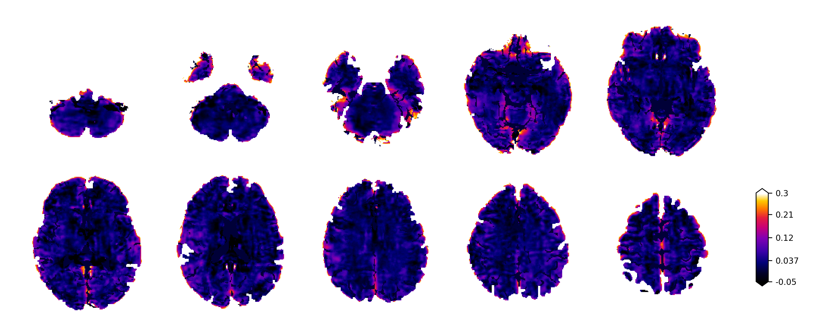
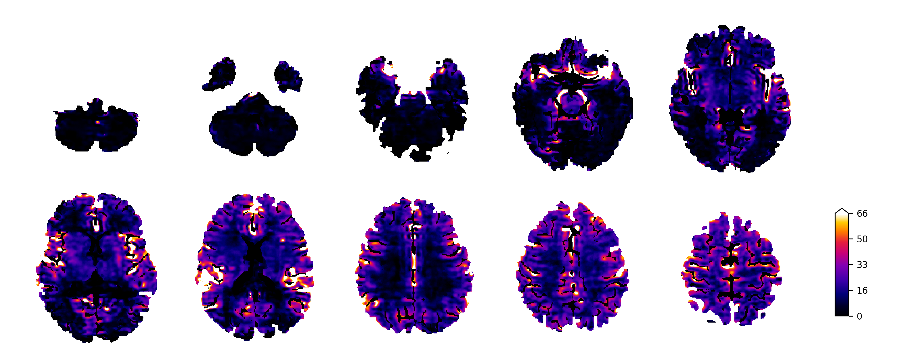
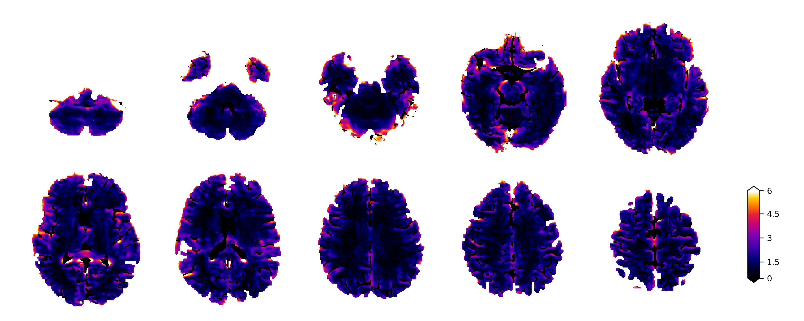
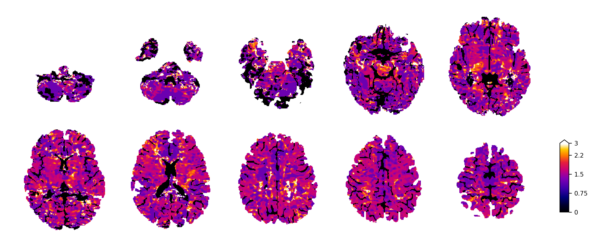
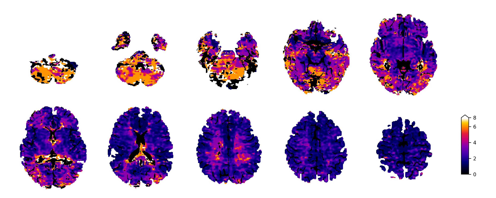
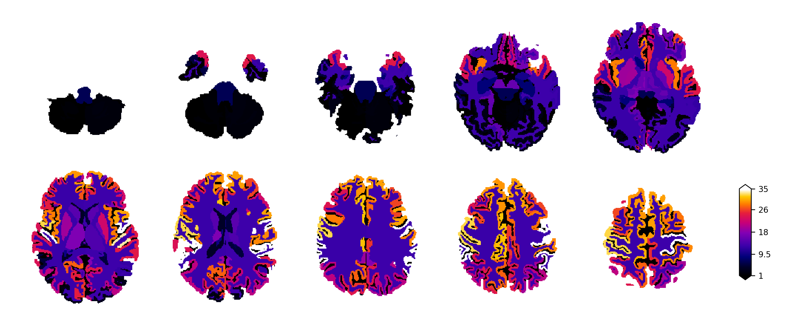

# _p_-Brain: Automated DCE-MRI Perfusion and Permeability Pipeline


_p_-Brain is an end-to-end neuroimaging analysis script that turns raw dynamic contrast-enhanced (DCE) MRI series into quantitative maps of blood–brain barrier leakage, vascular volume, and perfusion. The toolkit combines classical pharmacokinetic modeling with CNN-based region-of-interest (ROI) extraction, anatomical parcellation, and transparent quality-control outputs so that a single command can deliver voxel-wise, parcel-wise, and whole-brain readouts of:

- BBB influx constant Ki
- Plasma volume vp
- Extended Tofts parameters (Ktrans, kep, ve)
- Cerebral blood flow (CBF)
- Mean transit time (MTT)
- Capillary transit-time heterogeneity (CTH)

> **Author:** Edis Devin Tireli, M.Sc., Ph.D. student  
> **Affiliations:** Functional Imaging Unit, Copenhagen University Hospital – Rigshospitalet, and Department of Neuroscience, University of Copenhagen.

---

## Quick navigation
1. [Why p-Brain?](#why-p-brain)
2. [Data layout and repository structure](#data-layout-and-repository-structure)
3. [Installation](#installation)
4. [Running the script](#running-the-script)
5. [Workflow details](#workflow-details)
6. [Outputs and deliverables](#outputs-and-deliverables)
7. [Automation features](#automation-features)
8. [Configuration and environment variables](#configuration-and-environment-variables)
9. [Addons](#addons)
10. [Contributing & support](#contributing--support)
11. [License & acknowledgments](#license--acknowledgments)

---

## Why p-Brain?
Traditional DCE-MRI analysis requires hand-drawn ROIs for arterial/venous input functions, manual tissue masking, and bespoke scripts for each pharmacokinetic model. _p_-Brain removes these bottlenecks:

- **Single script, full pipeline** – From T1/M0 fitting to Patlak, extended Tofts, and deconvolution-based residue analysis.
- **CNN-driven automation** – Neural networks detect the right internal carotid artery (rICA) and superior sagittal sinus (SSS); FastSurfer-based anatomical segmentations define tissue ROIs.
- **Multi-scale reporting** – Every run produces voxel mosaics, parcel tables, slice-wise distributions, and whole-brain medians for Ki, vp, CBF, MTT, and CTH.
- **Reproducible QC** – Time-shifted concentration curves, Patlak fits, reference comparisons, and cohort projections are generated automatically so every decision is traceable.
- **Batch-ready** – `enumerator.py` runs the pipeline over entire cohorts with optional control handling and environment-based overrides.

---

## Data layout and repository structure
### Expected dataset tree
By default the GUI scans the `data/` directory (override via `--data-dir` or `P_BRAIN_DATA_DIR`). Each exam folder should contain raw input as well as the derived analysis subfolders:

```
data/
└── subject_id/
    ├── x.PAR / x.REC   # raw Philips exports (optional if NIfTI already provided)
    ├── NIfTI/          # populated automatically when converting PAR/REC
    ├── Analysis/
    │   ├── CTC Data/
    │   ├── TSCC Data/
    │   ├── ITC Data/
    │   └── ROI Data/
    └── Images/
```

Control cohorts live under `data/controls/<id>`. Set `PBRAIN_CONTROLS=1` or pass `--controls` to `enumerator.py` so the script automatically tags outputs with a `control.json` descriptor.

### Repository overview
| Path | Description |
|------|-------------|
| `modules/` | CLI menus, modeling backends, and GUI hooks. |
| `utils/` | Configuration, plotting helpers, and shared utilities. |
| `AI/` | Default CNN weights for rICA/SSS slice detection and ROI segmentation. |
| `addons/` | Optional plugins (e.g., GM/WM boundary ROIs). |
| `src/img/` | Repository-owned images used exclusively in the README. |
| `main.py` | Interactive runner used by the GUI/CLI. |
| `enumerator.py` | Batch launcher that iterates over multiple datasets. |

Key filenames (configured in `utils/parameters.py`) include the axial 2D reference image, DCE series, inversion recovery stack (WIPTI_xxxxx.nii), and optional 3D T1/T2/FLAIR reconstructions. Dedicated `control_*` entries allow alternative names for control acquisitions.

---

## Installation
1. **Clone the repository**
   ```bash
   git clone https://github.com/edtireli/p-brain.git
   cd p-brain
   ```
2. **Install dependencies**
   ```bash
   pip install -r requirements.txt
   ```
3. *(Optional)* **Fetch addon submodules**
   ```bash
   git submodule update --init -- addons/<addon_name>
   ```

Version strings are derived automatically from `git describe --tags` inside `modules/__init__.py`, so releases always match the tag checked out locally.

---

## Running the script
### Interactive GUI/CLI
```bash
python3 main.py
```
1. A small GUI lists available dataset folders under the configured data directory. Select one and click **Accept**.
2. The terminal menu appears and offers three modes:
   - **Manual mode** – Step-by-step execution with GUI ROI drawing.
   - **Automatic mode** – Fully automated pipeline (CNN inputs, FastSurfer segmentation, Patlak/Tofts/deconvolution, reporting).
   - **Pseudo-automatic mode** – Hybrid workflow where the user can review intermediate ROIs before modeling.

### Manual menu overview
| Option | Purpose |
|--------|---------|
|0|View MRI series (axial/sagittal).|
|1|Fit T1/M0 from the inversion recovery stack.|
|2|Generate concentration time curves (CTCs) from user-drawn ROIs.|
|3|Time-shift venous curves to arterial peaks (with amplitude rescaling if necessary).|
|4|Create tissue-specific CTCs (GM, WM, cerebellum, boundary, etc.).|
|5|Estimate BBB permeability (Patlak + extended Tofts) and residue-derived perfusion metrics.|
|6|Add free-form analysis notes to the dataset.|
|7|Invoke addons (boundary ROI extraction, screenshots, ...).|
|9|Exit.|

### Batch processing
`enumerator.py` wraps `main.py` so whole cohorts can be processed unattended:
```bash
python enumerator.py 1001 1002
python enumerator.py --all
python enumerator.py --controls 01 02
python enumerator.py --controls --all
```
Use `--data-dir` or `P_BRAIN_DATA_DIR` to point to an alternate root. The script automatically toggles `PBRAIN_CONTROLS` when `--controls` is provided.

#### Diffusion/tractography overrides
- `--diffusion-file <filename>` lets you select a specific diffusion volume for both FA metrics and tractography. Pass either an absolute path or a filename relative to each dataset’s `NIfTI/` folder (e.g. `--diffusion-file WIPDWI_highres.nii.gz`).
- `--orientation {tensor,dti,csd,mt_csd,qball,gqi}` continues to override the tractography model. `csd` uses the legacy single-shell fit, whereas `mt_csd` (alias: `msmt`, `msmt_csd`) runs the multi-tissue MSMT-CSD solver when multi-shell diffusion data are available. In both modes, the pipeline inspects how many non-b0 diffusion directions are available and automatically picks the largest safe spherical-harmonic (SH) order; sparse datasets fall back to lower SH orders to avoid ill-conditioned fits.
- `--tracks_dont_recompute` skips streamline regeneration whenever `--tracks` (or `--tracks_only`) is present. This is handy for combos like `--diffusion_only --tracks_only --tracks_dont_recompute`, which recompute FA metrics but simply refresh tract renders/montages from an existing `tractography.trk`.
- `--tracks_force` ignores cached streamlines and forces a fresh tractography build, even if `tractography.trk` already exists.
- Advanced users can still pin the SH order via `P_BRAIN_TRACK_CSD_SH_ORDER`. Setting it to `auto` (default) keeps the adaptive behavior; numeric values force a specific even order.
- Tractography attempts now support parallel execution via `P_BRAIN_TRACK_WORKERS`. Set it to the number of CPUs you want to dedicate (defaults to 1 to preserve historical behavior). The default backend uses threads; set `P_BRAIN_TRACK_PARALLEL_BACKEND=process` if you prefer separate worker processes. Combine this with `OMP_NUM_THREADS=1` when running on multi-socket machines so BLAS-heavy steps do not oversubscribe the system. Progress bars remain accurate even when attempts finish out of order.
- To keep the CLI `--orientation csd` flag but still force multi-tissue MSMT-CSD, export `P_BRAIN_TRACK_FORCE_MT_CSD=1`. When set, every CSD request runs through the MSMT solver and logs the override inside `Analysis/diffusion/tractography_debug.json`.

---

## Workflow details
The automated workflow mirrors the structure shown below. Gray boxes are completely unsupervised; white boxes correspond to manual overrides when running in manual or pseudo-automatic mode.

1. **Inputs** – Minimum requirements: 3D T1-weighted structural volume, inversion recovery series (for T1/M0), and a 4D DCE time series. Optional diffusion data enables automated FA reporting.
2. **Preprocessing** – Optional PAR/REC conversion via `dcm2niix`, rigid alignment of structural volumes to DCE space, and consistency checks on slice timing.
3. **T1/M0 fitting** – Trust-region reflective solver fits the inversion recovery signal model with configurable inversion delays and relaxivity (default r1 = 4 s-1 mM-1).
4. **Input-function extraction** – CNN slice classifier + ROI segmentation detect rICA and SSS. Venous curves are cross-correlated and rescaled to the arterial peak, compensating for transit delays and dispersion.
5. **Tissue ROIs** – FastSurfer-based parcellations (with optional FSL anatomical priors) define cortical GM, subcortical GM, WM, cerebellar lobes, brainstem, and GM/WM boundary masks. Affine transforms propagate labels to DCE geometry.
6. **Signal-to-concentration conversion** – Spoiled-GRE equation transforms signal intensity into gadolinium concentration using fitted T1, M0, flip angle, and TR. Guards prevent invalid logarithms or unstable tails.
7. **Modeling**  
   - **Patlak graphical analysis** for Ki and vp with user-configurable linear windows and residual-based uncertainty estimates.
   - **Extended Tofts model** with Levenberg–Marquardt fitting for Ktrans, ve, vp, and kep.
   - **Model-free deconvolution** (Tikhonov-regularized) providing CBF, MTT, and CTH from the residue function. An experimental gamma-variate estimator is also exposed for benchmarking.
8. **Outputs** – Quantitative NIfTI maps, PNG mosaics, JSON summaries, CSV/TSV tables, cohort boxplots, atlas projections, and optional reference comparisons.
9. **Quality assurance** – Automated checks for segmentation failures, mask overlaps, motion spikes, atypical AIFs, fit residuals, and log integrity. All warnings are logged alongside the outputs.

---

## Outputs and deliverables
Every automatic run produces the following without additional scripting:

- **Voxel-wise maps** – Ki, vp, CBF, CTH, and MTT stored as NIfTI volumes plus pre-rendered mosaics.
- **Parcellated summaries** – FastSurfer atlas statistics for each parameter, exported as tables and overlay images.
- **Slice-wise distributions** – Boxplots showing superior–inferior trends for Ki, vp, and perfusion metrics; useful for QC and cohort comparisons.
- **Whole-brain medians** – GM, WM, cerebellar, and boundary medians saved in JSON for rapid reporting or EHR integration.
- **Cohort projections** – When multiple datasets exist, the script averages parcel values across subjects and projects them onto a reference segmentation to create cohort fingerprints.
- **Reference comparisons** – Optional automated figures contrasting _p_-Brain outputs with the Perffit2 implementation (GM/WM boxplots and subject-wise scatter plots).
- **Processing transparency** – Composite figures stacking segmentations, input functions, tissue curves, Patlak fits, and resulting parameter maps, ensuring every automated decision is reviewable.

All generated assets reside under the selected dataset folder inside `Analysis/`, `Images/AI_patlak`, `Images/AI_tikhonov`, and companion JSON/CSV directories.

---

## Representative results gallery
The figures below summarize what a fully automatic run produces for a technically uniform cohort of 97 DCE-MRI scans from 58 participants with mild traumatic brain injury (mTBI) but no macroscopic lesions on structural MRI. Each dataset was processed with the same automated sequence of segmentation, vascular input extraction, concentration conversion, and kinetic modeling (Patlak + extended Tofts + deconvolution). The resulting deliverables span voxelwise maps, parcellated summaries, slice-wise distributions, cohort fingerprints, and compact QC dashboards. The PNGs stored under `src/img/` are the actual exports from the pipeline.

### Voxelwise maps
Voxelwise maps quantify physiological parameters at native spatial resolution so you can examine localized BBB leakage, perfusion, and vascular volume without aggregating over parcels. These maps constitute the foundation for every downstream summary in the pipeline.

- **BBB influx (Ki)** – Patlak-derived unidirectional transfer constant that reflects blood–brain barrier permeability.

  

- **Cerebral blood flow (CBF)** – Model-free residue deconvolution highlights expected perfusion contrast between cortical/subcortical gray matter and deep white matter and resolves major vessels such as the circle of Willis.

  

- **Plasma volume (vp)** – Patlak intercept emphasizes the intravascular compartment along cortical ribbons and venous structures.

  

- **Capillary transit-time heterogeneity (CTH)** – Derived from the normalized outflow $h(t)=-r'(t)/\int(-r')$, revealing spatial mottling that reflects variability in capillary passage times.

  

- **Mean transit time (MTT)** – First-moment summary of the residue function that complements CTH by capturing overall transit duration.

  

### Regional and parcellated organization
FastSurfer anatomical labels propagated to DCE space allow every quantitative map to be summarized into parcel medians for rapid comparisons across lobes, networks, or subject groups. These exports double as CSV/TSV tables for statistics packages, see e.g. the parcelwise CBF map. 

- 

### Cohort distributions and QC
Slice-wise boxplots summarize how each metric evolves along the superior–inferior axis, preserving the expected gray/white hierarchy while flagging outliers or motion-contaminated slabs.

### Cohort-level atlas projection
Aggregating parcel statistics across subjects produces cohort fingerprints that can be projected back onto a reference segmentation for quick visual baselines.

### End-to-end transparency
Composite panels document the entire automation chain—segmentation, vascular input functions, tissue curves, Patlak fits, and resulting parameter maps—so every decision remains auditable.


### Whole-brain medians
For dashboards or EHR-style summaries, the pipeline reports tissue-specific medians that retain GM>WM ordering while condensing each scan to a few numbers.

#### Summary of findings
The automated pipeline delivers physiologically consistent voxelwise maps, regional summaries, cohort-level projections, and QC figures without user interaction. Exporting these assets alongside transparent diagnostics provides a repeatable baseline for longitudinal monitoring, multi-site harmonization, and future research extensions.

---


## Automation features
### Neural-network models
Four CNNs orchestrate input-function detection:
- Slice classifier (rICA)
- ROI segmentation (rICA)
- Slice classifier (SSS)
- ROI segmentation (SSS)

Default paths live in `utils/settings.py` under `AI_MODEL_PATHS`. Override via environment variables:
```
SLICE_CLASSIFIER_RICA_MODEL
RICA_ROI_MODEL
SLICE_CLASSIFIER_SS_MODEL
SS_ROI_MODEL
```
Pretrained weights are hosted on [Zenodo](https://doi.org/10.5281/zenodo.15655347); download them into the `AI/` directory.

### Kinetic model selection
Set `P_BRAIN_MODEL` (or edit `KINETIC_MODEL` in `utils/settings.py`) to control which models run:
- `patlak`
- `two_compartment` (extended Tofts + deconvolution)
- `both` (default)

Output files are suffixed with `_patlak` or `_tikhonov` and written to `Images/AI_patlak` and `Images/AI_tikhonov` respectively.

### T1 recovery model
Choose between inversion recovery (default) and saturation recovery by setting `P_BRAIN_T1_RECOVERY_MODEL` to `saturation`.

### Regularisation strength
Adjust the Tikhonov parameter via `--lambda`, `P_BRAIN_LAMBDA`, or the corresponding entry inside `utils/settings.py`. The default value is 5.0.

### Global Ki slice exclusion
Skip inferior/superior slices when summarizing whole-brain Ki values by setting:
```
P_BRAIN_GLOBAL_KI_SKIP_BOTTOM
P_BRAIN_GLOBAL_KI_SKIP_TOP
```
Both default to 2.

### Custom datasets and jump-fix
- Drop an `apply_jumpfix.json` next to a dataset to enable automatic correction of sudden signal jumps.  
- Provide your own neural-network weights by placing them inside `AI/` and updating `utils/settings.py`.

---

## Configuration and environment variables
Most behaviour is controlled through `utils/settings.py` and `utils/parameters.py`. Important toggles include:

| Setting / Env var | Purpose |
|-------------------|---------|
| `DATA_DIR`, `P_BRAIN_DATA_DIR` | Root directory scanned by the GUI/CLI. |
| `SEGMENTATION_METHOD` | Choose between FastSurfer and alternative segmentation backends. |
| `CONTROLS`, `PBRAIN_CONTROLS` | Flag dataset as control during batch runs. |
| `KINETIC_MODEL`, `P_BRAIN_MODEL` | Select Patlak, extended Tofts, or both. |
| `T1_RECOVERY_MODEL`, `P_BRAIN_T1_RECOVERY_MODEL` | Toggle inversion vs. saturation recovery. |
| `AI_MODEL_PATHS`, `SLICE_CLASSIFIER_*`, `*_ROI_MODEL` | Custom CNN checkpoints for input-function detection. |
| `P_BRAIN_LAMBDA` | Tikhonov regularisation strength for deconvolution. |
| `P_BRAIN_GLOBAL_KI_SKIP_*` | Number of slices ignored when computing whole-brain Ki medians. |

Edit the Python files directly for permanent defaults or export environment variables for per-run overrides.

---

## Addons
Addons extend the manual workflow via menu option 7:
- **Boundary addon** – Generates GM/WM boundary ROIs (via `fsl_anat`) and associated CTCs.
- **Screenshot addon** – Navigate through axial slices and export presentation-quality PNG images.

Initialize individual addons with:
```bash
git submodule update --init -- addons/<addon_name>
```

---

## Contributing & support
- Open issues or feature requests on GitHub.
- For direct contact, reach out to Edis Tireli.
- Pull requests should follow the existing directory layout and reference the appropriate configuration flags in `utils/settings.py` and `utils/parameters.py`.

---

## License & acknowledgments
- **License:** MIT (see `LICENSE`).
- **Acknowledgments:** Henrik B. W. Larsson, Ulrich Lindberg, Stig P. Cramer, Mark Vestergaard, and Antonis Asiminas for continuous collaboration and discussions.

_p_-Brain is developed within the Functional Imaging Unit, Department of Clinical Physiology and Nuclear Medicine, Copenhagen University Hospital – Rigshospitalet, and the University of Copenhagen. The released CNN weights are available on Zenodo for reproducible deployment.
