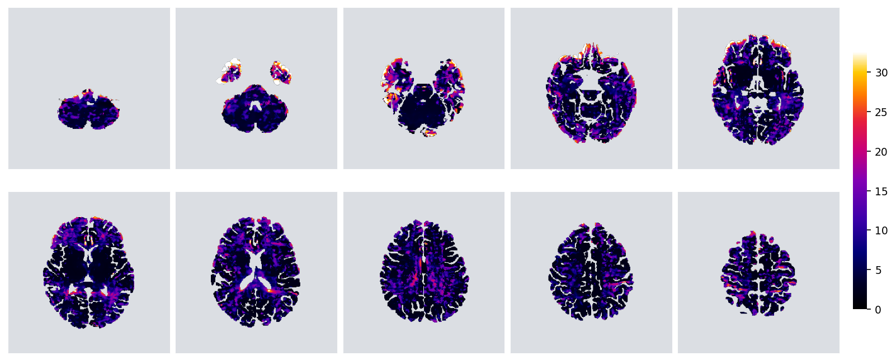
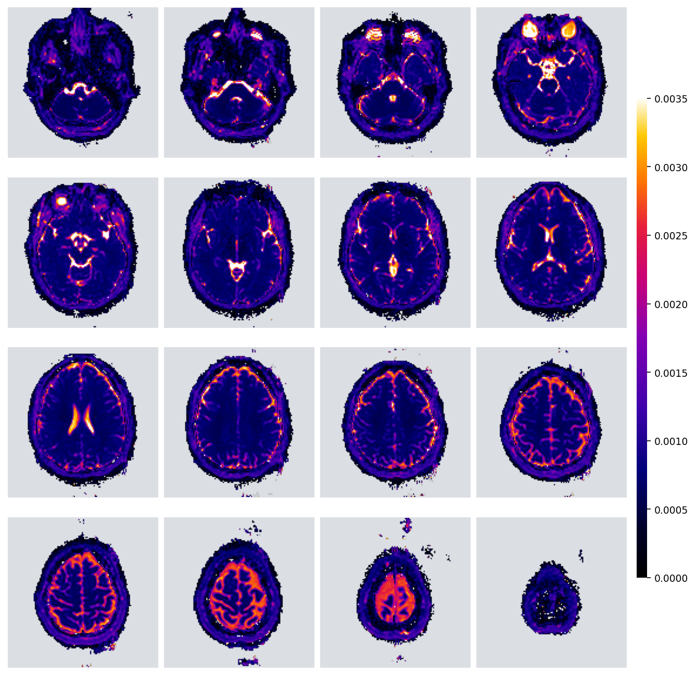

# _p_-Brain — modular DCE-MRI & diffusion analysis


_p_-Brain turns raw dynamic-contrast-enhanced (DCE) MRI and diffusion (DWI)
series into quantitative parameter maps — blood–brain-barrier leakage,
perfusion, capillary transit-time heterogeneity, and white-matter
microstructure — through a **fully modular, plug-and-play pipeline**. Every
step is a single-file plug-in that is auto-discovered at runtime; research
groups add new models or swap methods by dropping a file in, with **zero
changes to the core**.

> **Author:** Edis Devin Tireli, M.Sc., Ph.D. student
> **Affiliations:** Functional Imaging Unit, Copenhagen University Hospital – Rigshospitalet; Department of Neuroscience and Department of Clinical Medicine, University of Copenhagen.

Quantitative outputs include BBB influx **Ki** and plasma volume **vp**
(Patlak), **CBF / MTT / CTH** (Tikhonov deconvolution, with empirical-Bayes
λ-selection and per-voxel uncertainty), extended-Tofts **Ktrans/ve/vp**, and
the full diffusion panel **FA, MD, MK, KFA, μFA, GFA, free-water, RSI
restricted-fraction**.

---

## Contents

1. [Install](#install)
2. [Quick start](#quick-start)
3. [Config files](#config-files)
4. [The plug-in architecture](#the-plug-in-architecture)
5. [Adding your own model / method / stage](#adding-your-own)
6. [Models shipped](#models-shipped)
7. [Diffusion track](#diffusion-track)
8. [Outputs](#outputs)
9. [Demo (synthetic phantom)](#demo)
10. [Repository structure](#repository-structure)

---

## Install

```bash
git clone https://github.com/edtireli/p-brain.git
cd p-brain
pip install -r requirements.txt
python -m pbrain check-deps          # verify deps; offers to pip-install missing
```

Required: `numpy, scipy, matplotlib, nibabel`. Optional (only if you select a
plug-in that needs it): `dipy` (diffusion), `tensorflow` (CNN AIF), `torch`
(`--device mps/cuda`), `pydicom` (DICOM input), `pyyaml` (YAML config),
`dmri-amico` (NODDI).

---

## Quick start

```bash
# kinetic only
python -m pbrain run \
    --subject-dir /data/sub-01 \
    --dce dce.nii.gz --ir ir.nii.gz --t1 t1.nii.gz \
    --models patlak,tikhonov_bayes \
    --aggregations voxelwise,parcel,region \
    --device auto

# kinetic + diffusion in one command
python -m pbrain run \
    --subject-dir /data/sub-01 \
    --dce dce.nii.gz --ir ir.nii.gz --t1 t1.nii.gz --dwi dwi.nii.gz \
    --models patlak,tikhonov_bayes \
    --aggregations region,parcel \
    --device auto
```

When `--dwi` is given and `--diffusion` is omitted, a shell-aware default
bundle is chosen automatically (single-shell → `dti`; multi-shell → `dti,
dki, dki_micro, csd, fwdti, rsi`). Override with `--diffusion dti,csd` or
`--diffusion all`, disable with `--diffusion ""`.

Runs are **resumable**: a stage whose output already exists is skipped, so
re-running the same command (after a crash, or to add a model) continues in
seconds. Pass `--force` to recompute everything. Every output manifest is
stamped with the `pbrain` version + the resolved plug-in selection and
options (provenance). `--quiet` / `--verbose` / `--log-file <path>` control
logging.

**Run a whole cohort** — parallel, error-isolated, resumable:

```bash
python -m pbrain run-cohort \
    --config study.toml \
    --subjects-glob '/data/sub-*' \
    --workers 8
```

Each subject runs as a `pbrain run` would; a `{subject}` token in any config
input path is substituted with the subject's directory name. Failures are
isolated per subject and summarised at the end (ok / failed).

**See what's installed** — every plug-in, its contract, its diagnostic:

```bash
python -m pbrain list             # overview of all plug-points
python -m pbrain list models      # outputs, units, primary map, diagnostic source
python -m pbrain list diffusion
```

**Override any plug-in option** with `--opt <plug-point>.<plugin>.<key>=<value>`:

```bash
--opt models.tikhonov.lambda_selection=gcv
--opt models.tikhonov_bayes.uncertainty_samples=400
--opt models.patlak.regression=huber
--opt aif.cnn_sss_shifted.n_voxels=64
```

---

## Config files

A versionable, shareable alternative to a long command line. `pbrain run
--config study.toml` (or `.yaml`); **CLI flags override the file**.

```toml
subject_dir = "/data/sub-01"

[inputs]
dce = "dce.nii.gz"
ir  = "ir.nii.gz"
t1  = "t1.nii.gz"
dwi = "dwi.nii.gz"

[pipeline]
t1m0         = "preloaded"
aif          = "cnn_sss_shifted"
tissue_roi   = "preloaded"
models       = ["patlak", "tikhonov_bayes"]
diffusion    = "default"
aggregations = ["region", "parcel"]
path_scheme  = "bids_like"
device       = "auto"

[acquisition]
flip_angle_deg = 8.0
tr_s           = 0.01118

# Per-plug-in options — same keys as --opt
[options]
"models.tikhonov_bayes.uncertainty_samples" = 200
"t1_m0.preloaded.t1_ms_path" = "/data/sub-01/t1_map.nii.gz"
```

TOML works out of the box (stdlib); YAML needs `pip install pyyaml`.

---

## The plug-in architecture

The pipeline is a chain of **stages**, each delegating to a **plug-in** chosen
from a registry. Both stages and plug-ins are auto-discovered — drop a file in
the right directory and it appears. There are 12 plug-points:

| plug-point | what it does | CLI flag |
|---|---|---|
| `io/loaders/` | read NIfTI / PAR-REC / DICOM | (auto by extension) |
| `io/path_schemes/` | output layout (BIDS-like / legacy) | `--path-scheme` |
| `t1_m0/` | T1 & M0 fitting | `--t1m0` |
| `aif/` | arterial input function extraction | `--aif` |
| `tissue_roi/` | parcellation / ROI provider (incl. **bring-your-own**) | `--tissue-roi` |
| `signal_to_conc/` | signal → concentration | `--signal-to-conc` |
| `normalisation/` | curve normalisation / alignment | `--normaliser` |
| `models/` | kinetic models | `--models` |
| `diffusion/` | diffusion models | `--diffusion` |
| `aggregation/` | voxel / parcel / region / slice rollups | `--aggregations` |
| `diagnostics/` | per-curve diagnostic plots | (auto by model) |
| `stages/` | pipeline steps themselves | (discovered + ordered) |

Key design properties:

- **Auto-discovery.** Each plug-point's `__init__.py` calls `discover()`, which
  scans the directory for modules exporting a `PLUGIN` and indexes them by key.
- **Stages talk via file manifests**, not in-process objects — re-run one stage
  without the rest.
- **Stages are themselves a plug-point**, ordered by a topological sort over
  each stage's `requires` declaration — no hardcoded pipeline list. A new stage
  with `requires=("kinetic",)` slots in after the kinetic stage automatically.
- **One options mechanism.** Every plug-in knob lives in `plugin_options`
  (set via `--opt` or the config file). There are **no per-model fields baked
  into the core Config** — research-group params need zero core changes.
- **Generic aggregation & diagnostics.** Aggregators iterate whatever maps a
  model emits; the diagnostic stage resolves a plot via `model.diagnose()` →
  `diagnostics/<key>.py` → a generic fallback. A new model gets voxel/tissue/
  parcel diagnostics for free.

Full contract reference and templates: [`docs/ADDING_PLUGINS.md`](docs/ADDING_PLUGINS.md).

### Swapping the segmentation backend

Built-in providers: `synthseg`, `fastsurfer`, `preloaded` (use a parcellation
you already have), `voxelwise`, `manual`. To use **any other tool** without
writing a plug-in, pick `command` and give the command in **one place**:

```bash
--tissue-roi command \
--opt tissue_roi.command.cmd="fastsurfer.sh --t1 {input} --seg {output} --seg_only"
```

`{input}` is the T1 NIfTI pbrain writes; the command must write a label volume
to `{output}`. FreeSurfer-style labels are grouped automatically (override with
`--opt tissue_roi.command.region_map='{...}'`).

---

## Adding your own

A new kinetic model is **one file** — `pbrain/models/two_cxm.py`:

```python
from dataclasses import dataclass
from typing import Any, ClassVar
import numpy as np
from .base import CurveInputs, ModelResult

@dataclass(frozen=True, slots=True)
class TwoCXM:
    key:         ClassVar[str] = "two_cxm"
    name:        ClassVar[str] = "Two-compartment exchange model"
    description: ClassVar[str] = "Fp, PS, vp, ve via 2CXM least-squares."
    accepts:     ClassVar[dict] = {"c_tissue": np.ndarray, "c_input": np.ndarray, "t_s": np.ndarray}
    produces:    ClassVar[dict] = {"fp": np.ndarray, "ps": np.ndarray, "vp": np.ndarray, "ve": np.ndarray}
    outputs:     ClassVar[tuple] = ("fp", "ps", "vp", "ve")
    units:       ClassVar[dict] = {"fp": "mL/100g/min", "ps": "mL/100g/min", "vp": "fraction", "ve": "fraction"}
    primary_map: ClassVar[str]  = "fp"

    def fit(self, inputs: CurveInputs, **opts: Any) -> ModelResult:
        ...   # your math
        return ModelResult(maps={"fp": fp, "ps": ps, "vp": vp, "ve": ve},
                           units=dict(self.units))

PLUGIN = TwoCXM()
```

Then `python -m pbrain run --models two_cxm,patlak ...` runs it, aggregates all
four maps at every level, and renders diagnostics — no other file touched. Same
recipe for AIF extractors, normalisers, diffusion models, or whole new
pipeline stages. See [`docs/ADDING_PLUGINS.md`](docs/ADDING_PLUGINS.md).

---

## Models shipped

**Kinetic** (`--models`):

| key | outputs | notes |
|---|---|---|
| `patlak` | ki, vb | robust default (AIF-floor + OLS / Huber) — BBB leakage |
| `patlak_legacy` | ki, vb | byte-frozen legacy OLS parity |
| `tikhonov` | cbf, mtt, cth, λ | GCV λ-selection, log-spaced grid |
| `tikhonov_legacy` | cbf, mtt, cth, λ | bit-equal to the legacy production solver |
| `tikhonov_bayes` | cbf, mtt, cth, λ, **cbf_sd** | empirical-Bayes λ + calibrated uncertainty |
| `extended_tofts` | ktrans, ve, vp, kep | constrained Levenberg-Marquardt |

`tikhonov_bayes` is a novel contribution — it dissolves the L-curve/GCV
endpoint-collapse via marginal-likelihood λ-selection and reports per-voxel
posterior SD on CBF (λ-marginalised, validated calibrated). See
[`docs/tikhonov_bayes_explained.md`](docs/tikhonov_bayes_explained.md).

### Kinetic options & defaults

Every option is set with `--opt models.<key>.<opt>=<value>` (or in a config
file). Defaults are the values used when you don't set anything.

**`patlak`** — BBB influx Ki and blood volume vp from the Patlak plot.
| option | default | what it does |
|---|---|---|
| `regression` | `huber` | slope fit: `huber` (robust, down-weights leverage points) or `ols` (plain least-squares). |
| `tail_mode` | `smart` | which late time-points enter the fit: `smart` (curvature-detected linear tail) or `legacy` (fixed upper-2⁄3 window). |
| `aif_min_fraction` | `0.05` | drop AIF samples below this fraction of the peak — prevents a near-zero AIF from blowing Ki up (always on). |

**`tikhonov`** — CBF, MTT, CTH by regularised SVD deconvolution of the residue function.
| option | default | what it does |
|---|---|---|
| `lambda_selection` | `gcv` | regularisation-strength picker: `gcv` (generalised cross-validation), `lcurve` (Hansen corner), or `evidence` (marginal likelihood — most robust on smooth DCE curves). |
| `lambda_spacing` | `log` | λ grid spacing: `log` or `linear`. |
| `n_lambdas` | `121` | number of λ values searched. |
| `mtt_cth_method` | `residue_integral` | MTT/CTH from the residue function (`residue_integral`) or central-volume theorem (`central_volume`). |

**`tikhonov_bayes`** — same outputs plus a calibrated per-voxel CBF SD.
| option | default | what it does |
|---|---|---|
| `lambda_selection` | `evidence` | (forced — the Bayesian formulation needs the evidence λ.) |
| `compute_cbf_sd` | `true` | emit the closed-form posterior SD on CBF (`cbf_sd`). |
| `uncertainty_samples` | `0` | `0` = fast closed-form CBF SD; `>0` = draw that many λ-marginalised samples to also get MTT/CTH SD. |

**`extended_tofts`** — Ktrans, ve, vp, kep by constrained Levenberg-Marquardt (no tuning needed for the default fit).

**`patlak_legacy` / `tikhonov_legacy`** — byte-frozen reproductions of the legacy fits for parity checks; not meant for tuning.

**Diffusion** (`--diffusion`): see below.

---

## Diffusion track

A second plug-point parallel to the kinetic models, fitted in native DWI space
and resampled to the parcellation. The DWI input may be **NIfTI, PAR/REC, or
DICOM** — PAR/REC and DICOM are converted to NIfTI + FSL gradients on the fly
(`dcm2niix`), so DTI runs straight off raw scanner exports. For NIfTI input the
`.bval`/`.bvec` sidecars are auto-detected next to the DWI (override with
`--bvals`/`--bvecs`).

| key | outputs | notes |
|---|---|---|
| `dti` | fa, md, ad, rd, colorfa | tensor model (b≤1500) |
| `dki` | mk, ak, rk, kfa + DTI | kurtosis, multi-shell |
| `dki_micro` | awf, tortuosity, de_axial/radial, **ufa** | WMTI microstructure + μFA (Hansen) |
| `csd` | gfa, peak1, nufo | constrained spherical deconvolution |
| `fwdti` | tfa, tmd, tad, trd, **fw** | free-water elimination (Pasternak) |
| `rsi` | restricted / hindered / free | restriction spectrum (White) |
| `noddi` | icvf, odi, iso | needs AMICO + high-b shell |

### Which diffusion model, when

- **`dti`** — the workhorse: FA, MD, AD, RD (+ colour-FA). Works on any DWI
  with a b0 + one shell (uses b ≤ 1500). **Start here for FA/MD.**
- **`dki`** — adds mean/axial/radial **kurtosis** and KFA (non-Gaussian
  diffusion). Needs **≥ 2 non-zero shells**.
- **`dki_micro`** — WMTI microstructure (axonal water fraction, tortuosity,
  axial/radial De) and **μFA**. Multi-shell.
- **`fwdti`** — **free-water elimination**: tissue FA/MD with CSF/oedema
  removed, plus the free-water fraction `fw` (an oedema marker). Multi-shell.
- **`csd`** — constrained spherical deconvolution: GFA + fibre peak directions
  + number of fibre orientations (crossing fibres). Multi-shell preferred.
- **`rsi`** — restriction-spectrum fractions (restricted / hindered / free);
  needs a **high-b shell (≥ 1500)**.
- **`noddi`** — neurite density / orientation dispersion; needs **AMICO**
  installed and a high-b shell.

Selection: `--diffusion dti` (single model), `--diffusion dti,dki,fwdti`
(list), `--diffusion default` (shell-aware: `dti` always; multi-shell adds
`dki,dki_micro,csd,fwdti,rsi`), `--diffusion all`, or `--diffusion ""` to
disable. The DWI is given with `--dwi` and FSL `.bval`/`.bvec` sidecars are
auto-detected (override with `--bvals`/`--bvecs`). Each model's options are set
the same way as kinetic ones: `--opt diffusion.<key>.<opt>=<value>`.

---

## Outputs

BIDS-like layout under `<subject>/derivatives/`:

```
01_load/  02_t1m0/  03_aif/  04_tissue_roi/  05_signal_to_conc/
06_normalisation/  07_kinetic/<model>/{voxelwise,parcel,region,slice_wise}/
diffusion/<model>/{native,voxelwise}/  08_summary/  diagnostics/
```

Each stage writes a `manifest.json` declaring its outputs, its provenance
(`pbrain` version + resolved plug-in selection & options), and a QC block.
Downstream stages read by name; the resume logic reads it to skip completed
work. The `diagnostics` stage renders, every run: per-model fit plots and
**voxel / tissue / parcel montages of every parameter map**
(`…/diagnostics/montage/<map>_{voxel,tissue,parcel}.png`) — the figures shown
above.

---

## Representative output

Whole-brain parameter maps from a single subject — perfusion / leakage
(kinetic) and white-matter microstructure (diffusion). **These montages are
produced by the pipeline itself** — an independent, model-agnostic generator
(`diagnostics` stage) renders `voxel`, `tissue`, and `parcel` montages for
*every* map a model emits, so a new model gets them for free. The grid is the
balanced factorisation of the slice count (the 10-slice DCE → 2×5) and the
slices span each map's data extent — no hardcoded slice number (the DTI maps
below are 48-slice, same renderer):

| | |
|---|---|
| **Ki** — BBB influx (Patlak) | **CBF** — cerebral blood flow (Tikhonov) |
|  |  |
| **CTH** — capillary transit-time heterogeneity | **FA** — fractional anisotropy (DTI) |
|  |  |


*MD — mean diffusivity (DTI).* Every map is also aggregated to tissue
classes and DKT parcels.

---

## Demo

```bash
python -m pbrain.demo --clean
```

Synthesises a 64×64×10 four-region phantom (+ anisotropic DWI), runs the full
pipeline end-to-end — kinetic *and* diffusion — and writes 6-slice parameter-map
montages to `demo/maps/`. Verifies the whole system with zero patient data.

---

## Repository structure

```
pbrain/            the package — everything lives here
  core/            Plugin/Stage protocols, discovery, Config, Pipeline, devices
  io/              loaders (nifti/parrec/dicom/dwi) + path_schemes
  t1_m0/  aif/  tissue_roi/  signal_to_conc/  normalisation/
  models/          kinetic models + their tools
  diffusion/       diffusion models
  aggregation/     voxel/parcel/region/slice rollups
  diagnostics/     per-model diagnostic plots (+ generic fallback)
  stages/          the pipeline steps (a discoverable, topo-ordered plug-point)
  cli/             run / list / check-deps entry points + config-file loader
  demo/            synthetic-phantom end-to-end demo
AI/                CNN weights for the rICA/SSS AIF detector (runtime asset)
docs/              ARCHITECTURE.md, ADDING_PLUGINS.md, tikhonov_bayes_explained.md
tests/             pbrain test suite
validation/        cohort runners + validation notes/figures
```

---

## License & citation

See [`LICENSE`](LICENSE). If you use _p_-Brain in research, please cite the
accompanying paper (Tireli et al.) and this repository.
