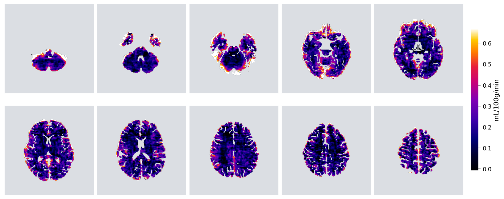
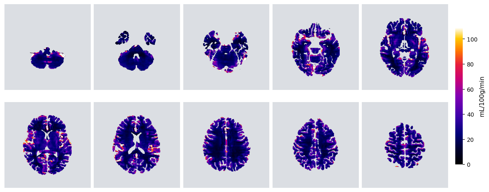
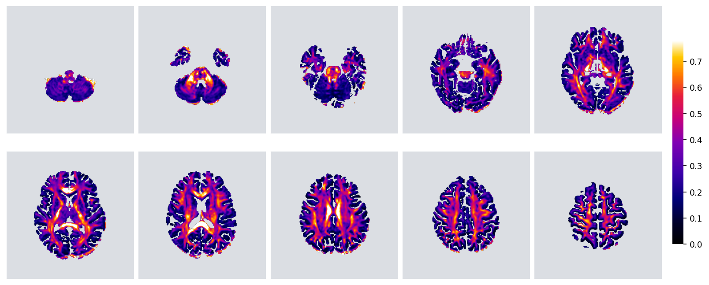

# _p_-Brain — a modular framework for automated DCE-MRI & diffusion research

[](https://github.com/edtireli/p-brain/actions/workflows/ci.yml)
[](https://www.python.org/)
[](LICENSE)
[](#install)


**_p_-Brain is a cross-platform Python command-line tool.** Install it with
`pip` on Linux, macOS, or Windows (Python 3.10–3.12), point `pbrain run` at a
subject's scans, and it produces the full derivatives tree — no notebook, no
GUI, no server required. The CLI is the product; an optional macOS desktop app
is just one front-end on top of it (see [below](#optional-macos-app)).

_p_-Brain takes raw dynamic-contrast-enhanced (and diffusion) MRI through the
whole analysis — T1/M0 mapping, arterial-input-function extraction,
signal-to-concentration conversion, tissue parcellation, pharmacokinetic and
diffusion modelling — and produces standardised voxel-, tissue-, and
parcel-level results, fully automatically.

It is two things at once. **As shipped it is a validated, ready-to-run
pipeline** you can point at real scanner data today and get publication-grade
maps (Ki, CBF, MTT, CTH, FA, …). And it is a **template you extend**: each step
is a self-contained plug-in, so adding your own kinetic model — or a different
AIF, segmentation backend, or whole stage — is a single file and **no changes
to the core**. Drop a model into `pbrain/models/`, call it with `--models
yourmodel`, and it is run on every subject, aggregated to every anatomical
level, written as NIfTI/CSV/JSON, and given diagnostics automatically.

The aim is to let groups stop re-implementing the same plumbing: use it as-is,
modify what you need, and extend it to go beyond — while everyone's outputs
stay directly comparable.

> If you use _p_-Brain in your research, please **cite our paper** (Tireli et
> al.; see [Citation](#citation)).

> **Author:** Edis Devin Tireli, M.Sc., Ph.D. student
> **Affiliations:** Functional Imaging Unit, Copenhagen University Hospital – Rigshospitalet; Department of Neuroscience and Department of Clinical Medicine, University of Copenhagen.

---

## Contents

1. [Why a framework](#why-a-framework) — the idea, and how the pieces fit
2. [Install](#install)
3. [How to run](#how-to-run) — first steps, the flags explained, quick start
4. [Add your own model — it's one file](#add-your-own) — the headline feature
5. [Config files](#config-files)
6. [Models](#models) — what's shipped, defaults, and every option
7. [Diffusion & connectomics](#diffusion)
8. [Outputs](#outputs) — the standardised result tree
9. [Representative output](#representative-output)
10. [Demo](#demo) · [Repository structure](#repository-structure) · [Citation](#citation)

---

## Why a framework

DCE-MRI analysis is a chain of stages — fit T1, find the artery, convert signal
to contrast concentration, segment tissue, fit a kinetic model, summarise. In
most labs each of these is bespoke code, so results are hard to compare and a
new model means re-plumbing the whole pipeline.

_p_-Brain makes each stage a **plug-in**: a single file that declares what it
needs and what it produces, discovered automatically at runtime. The
orchestrator wires the stages together by those declarations — so:

- **adding a method changes one file, never the core;**
- **every model is run, aggregated, and reported the same way**, giving
  standardised, directly-comparable outputs across groups;
- you can **swap any step** (a different AIF, your lab's segmentation tool, a
  new deconvolution) by name on the command line.

There are 12 such plug-points. The full contract and copy-paste templates live
in **[`docs/ADDING_PLUGINS.md`](docs/ADDING_PLUGINS.md)**; the design rationale
in **[`docs/ARCHITECTURE.md`](docs/ARCHITECTURE.md)**. Read those two when you
want to extend the framework — the rest of this README gets you running first.

---

## Install

_p_-Brain is a normal `pip`-installable Python package. It runs on **Linux,
macOS, and Windows** with **Python 3.10–3.12**.

```bash
pip install p-brain          # core install — installs the `pbrain` command
pbrain --help
```

That gives you the `pbrain` command (and `python -m pbrain`) plus the light core
dependencies — `numpy, scipy, matplotlib, nibabel`. Everything heavier is an
**opt-in extra**, installed only if you select a plug-in that needs it:

```bash
pip install "p-brain[cnn]"        # TensorFlow — CNN arterial-input-function (default AIF)
pip install "p-brain[diffusion]"  # dipy — the diffusion track (DTI/DKI/CSD/…)
pip install "p-brain[dicom]"      # pydicom — DICOM input (see DICOM input below)
pip install "p-brain[all]"        # everything in one go
```

The default AIF (`cnn_sss_shifted`) needs the CNN extra **and** its `.keras`
weights, distributed separately on Zenodo. To run weights-free, pick a classical
AIF (e.g. `--aif peak_scaled`) or try the demo, which needs none.

**From source** (for development or the bleeding edge):

```bash
git clone https://github.com/edtireli/p-brain.git
cd p-brain
pip install -e ".[dev]"           # editable install + test tooling
pytest -q                         # run the test suite
```

**Check your environment.** `python -m pbrain check-deps` verifies the
third-party Python deps and offers to install any that are missing;
`python -m pbrain setup` additionally inspects external tooling (`dcm2niix`,
optionally FreeSurfer for segmentation, GPU support) and walks you through it.

### DICOM input

_p_-Brain reads **NIfTI** (`.nii` / `.nii.gz`) and **Philips PAR/REC** natively.
**DICOM** is supported through [`dcm2niix`](https://github.com/rordenlab/dcm2niix),
the standard, well-validated DICOM→NIfTI converter: point `--dce` / `--ir` /
`--dwi` at a DICOM file or a folder of DICOMs and _p_-Brain calls `dcm2niix`
under the hood, picking up the reconstructed NIfTI (and, for diffusion, the
`.bval` / `.bvec` gradient tables it writes).

Install `dcm2niix` from its own channel — it is a compiled binary, not a pip
package:

```bash
conda install -c conda-forge dcm2niix     # any OS (recommended)
brew install dcm2niix                      # macOS
sudo apt install dcm2niix                  # Debian / Ubuntu
# Windows: download the release .zip from the dcm2niix GitHub and add it to PATH
```

`pip install "p-brain[dicom]"` adds `pydicom` for header inspection;
`dcm2niix` must be on your `PATH` for the actual conversion. Run
`python -m pbrain check-deps` to confirm it is found.

### Optional macOS app

A native macOS desktop app wraps this CLI in a point-and-click GUI for users who
prefer not to touch a terminal. It is **entirely optional** — the Python CLI
above is the product and the canonical interface; the app simply drives it.

---

## How to run

A run takes one subject's raw data and produces its full derivatives tree.
The first three steps:

1. **Point at your data.** `--dce` is the 4-D DCE series (NIfTI, PAR/REC, or
   DICOM — converted automatically). `--ir` is the inversion-recovery series
   used to fit T1/M0; `--dwi` is an optional diffusion scan. Each of `--dce`,
   `--t1`, `--ir` accepts a **full path, a filename, a protocol-name substring,
   or `auto`** — so you can write `--dce hperf --t1 auto --ir auto` once and
   reuse it across subjects whose scan numbers differ (raw PAR/REC are matched
   by their Philips `Protocol name`; `--ir auto` assembles the `TI_*` series).
2. **Choose your methods.** `--models patlak,tikhonov` selects the kinetic
   models; `--aif`, `--tissue-roi`, `--t1m0` select how each upstream step is
   done. Sensible defaults mean you can omit most of them.
3. **Choose your output levels.** `--aggregations voxelwise,region,parcel`
   controls whether you get whole-brain maps, tissue-class summaries, and/or
   per-parcel tables.

### The flags, explained

| flag | meaning | default |
|---|---|---|
| `--subject-dir` | where the derivatives tree is written | (required) |
| `--dce` | 4-D DCE series (NIfTI / PAR-REC / DICOM) | (required) |
| `--ir` | inversion-recovery series for the T1/M0 fit | — |
| `--dwi` | diffusion series (for the diffusion track) | — |
| `--t1m0` | how T1 & M0 are obtained (`inversion_recovery`, `vfa_spgr`, …) | `inversion_recovery` |
| `--aif` | arterial-input-function method | `cnn_sss_shifted` |
| `--tissue-roi` | parcellation source (`synthseg`, `fastsurfer`, `command`, `preloaded`, …) | `voxelwise` |
| `--models` | comma-list of kinetic models to run | `patlak,tikhonov` |
| `--diffusion` | comma-list of diffusion models, or `default`/`all` | (auto when `--dwi` given) |
| `--aggregations` | output levels: `voxelwise,region,parcel,slice_wise` | `voxelwise,parcel,region` |
| `--device` | `cpu` / `mps` / `cuda` / `auto` | `cpu` |
| `--config` | read all of the above from a `.toml`/`.yaml` file | — |

Two niceties: runs are **resumable** (a finished stage is skipped on re-run;
`--force` recomputes), and every output carries **provenance** (the `pbrain`
version and exact options that made it). Use `--quiet` / `--verbose` /
`--log-file` to control logging.

### Quick start

```bash
# Minimal: DCE + IR, the default models, all output levels
python -m pbrain run \
    --subject-dir /data/sub-01 \
    --dce dce.nii.gz --ir ir.nii.gz \
    --models patlak,tikhonov \
    --aggregations voxelwise,parcel,region

# With diffusion (FA/MD + tractography) in the same command
python -m pbrain run \
    --subject-dir /data/sub-01 \
    --dce dce.nii.gz --ir ir.nii.gz --dwi dwi.nii.gz \
    --models patlak,tikhonov --diffusion default
```

**See what's available** — every plug-in, its inputs/outputs, its diagnostic:

```bash
python -m pbrain list             # all plug-points at a glance
python -m pbrain list models      # one plug-point in detail
```

**Run a whole cohort** — parallel, resumable, error-isolated:

```bash
# ── one flag, raw scanner data: point --cohort at a folder of subjects ──
# Each sub-directory is a subject of raw Philips PAR/REC. Inputs are
# auto-discovered by protocol name (DCE = hperf*; the TI_* saturation-recovery
# series is assembled into an IR; a 3-D T1 anatomical for SynthSeg), then the
# full pipeline runs with ALL kinetic models at tissue (region) + parcel level.
# No config needed. Add --force for a fresh re-run. Pass several roots to run
# patients + controls + follow-ups in one go.
python -m pbrain run-cohort --cohort /data/patients /data/controls --workers 4 --force

#   pick models / levels, or skip known-bad subjects:
python -m pbrain run-cohort --cohort /data/patients --workers 4 \
    --models tikhonov,inverse_gaussian --aggregations region,parcel \
    --exclude 20221003x1            # --voxelwise to fit per-voxel (slower)

# ── config mode, pre-converted NIfTI cohorts: inputs from a shared config ──
python -m pbrain run-cohort --config study.toml --data-dir /data --workers 8
python -m pbrain run-cohort --config study.toml --subjects-glob '/data/sub-*' --workers 8
```

`--cohort` is the one-flag "do the whole study" path: it resolves each subject's
DCE / IR / T1 itself (scan numbers vary between subjects, so they can't be
templated by name) and fits every model at the parcel level by default
(average-then-fit — exactly the resolution these models support, and tractable
across hundreds of subjects). Use `--config` mode when inputs are already
NIfTI and named consistently.

**Override any option** with `--opt <plug-point>.<plugin>.<key>=<value>`, e.g.
`--opt models.tikhonov.lambda_selection=evidence`. Every knob is documented
under [Models](#models).

---

## Add your own

> **Step-by-step guide:** [`docs/ADDING_PLUGINS.md`](docs/ADDING_PLUGINS.md) —
> templates for models, AIF methods, segmentation backends, diffusion models,
> and whole pipeline stages. Start there.

A new kinetic model is one file and no core changes. You write the maths; the
framework runs it on every voxel/curve, aggregates the result to tissue classes
and parcels, writes NIfTI + CSV + JSON, and renders fit diagnostics.

`pbrain/models/two_cxm.py`:

```python
from dataclasses import dataclass
from typing import Any, ClassVar
import numpy as np
from .base import CurveInputs, ModelResult

@dataclass(frozen=True, slots=True)
class TwoCXM:
    key:         ClassVar[str] = "two_cxm"            # the name you call it by
    name:        ClassVar[str] = "Two-compartment exchange model"
    description: ClassVar[str] = "Fp, PS, vp, ve via 2CXM least-squares."
    outputs:     ClassVar[tuple] = ("fp", "ps", "vp", "ve")
    units:       ClassVar[dict]  = {"fp": "mL/100g/min", "ps": "mL/100g/min",
                                    "vp": "fraction", "ve": "fraction"}

    def fit(self, inputs: CurveInputs, **opts: Any) -> ModelResult:
        ...                                            # your maths → fp, ps, vp, ve
        return ModelResult(maps={"fp": fp, "ps": ps, "vp": vp, "ve": ve},
                           units=dict(self.units))

PLUGIN = TwoCXM()
```

That's the entire integration. Now:

```bash
python -m pbrain run --models two_cxm,patlak ...
```

runs your model alongside Patlak, produces `fp/ps/vp/ve` maps, aggregates each
to region and parcel level, and draws per-tissue fit plots — automatically.

The **step-by-step guide** for this and the other 11 plug-points (AIF methods,
segmentation backends, diffusion models, whole stages) is
**[`docs/ADDING_PLUGINS.md`](docs/ADDING_PLUGINS.md)** — start there.

---

## Config files

For reproducibility, put the whole run in a versioned file —
`pbrain run --config study.toml` (CLI flags still override it):

```toml
subject_dir = "/data/sub-01"

[inputs]
dce = "dce.nii.gz"
ir  = "ir.nii.gz"
dwi = "dwi.nii.gz"

[pipeline]
t1m0         = "inversion_recovery"
aif          = "cnn_sss_shifted"
tissue_roi   = "synthseg"
models       = ["patlak", "tikhonov"]
diffusion    = "default"
aggregations = ["region", "parcel"]

[acquisition]
flip_angle_deg = 30.0
tr_s           = 0.01118

[options]                                  # same keys as --opt
"models.tikhonov.lambda_selection" = "evidence"
```

TOML works out of the box; YAML needs `pip install pyyaml`.

---

## Models

Set any option with `--opt models.<key>.<opt>=<value>` (or in a config file).
Defaults are what you get without setting anything.

**`patlak`** — blood–brain-barrier influx **Ki** and blood volume **vp** from
the Patlak graphical analysis.

| option | default | what it does |
|---|---|---|
| `regression` | `huber` | slope fit: `huber` (robust to leverage points) or `ols`. |
| `tail_mode` | `smart` | which late points enter the fit: `smart` (curvature-detected linear tail) or `legacy` (fixed upper-2⁄3 window). |
| `aif_min_fraction` | `0.05` | drop AIF samples below this fraction of the peak (avoids a near-zero AIF blowing Ki up). |

**`tikhonov`** — **CBF, MTT, CTH** by regularised deconvolution of the residue
function.

| option | default | what it does |
|---|---|---|
| `lambda_selection` | `gcv` | regularisation strength: `gcv` (cross-validation), `lcurve`, or `evidence` (marginal likelihood — most robust on smooth curves). |
| `lambda_spacing` | `log` | λ grid spacing (`log`/`linear`). |
| `n_lambdas` | `121` | number of λ values searched. |
| `mtt_cth_method` | `residue_integral` | MTT/CTH from the residue integral or the central-volume theorem. |

**`extended_tofts`** — **Ktrans, ve, vp, kep** by constrained
Levenberg–Marquardt (no tuning needed for the default fit).

You are meant to add to this list — see [Add your own](#add-your-own).

---

## Diffusion

Give a diffusion scan with `--dwi` (NIfTI, PAR/REC, or DICOM — converted
automatically, gradients extracted) and the diffusion track runs in native DWI
space and resamples to your parcellation. Select models with `--diffusion`
(`dti`, a comma-list, `default` = shell-aware, or `all`); options via
`--opt diffusion.<key>.<opt>=<value>`.

### Which model, when

- **`dti`** — the workhorse: **FA, MD, AD, RD** (+ colour-FA). Any DWI with a
  b0 and one shell. **Start here for FA/MD.**
- **`dki`** — adds mean/axial/radial **kurtosis** and KFA. Needs ≥ 2 shells.
- **`dki_micro`** — WMTI microstructure (axonal water fraction, tortuosity) and
  **μFA**. Multi-shell.
- **`fwdti`** — **free-water elimination**: tissue FA/MD with CSF/oedema removed
  + the free-water fraction. Multi-shell.
- **`csd`** — constrained spherical deconvolution: fibre orientations for
  tractography + GFA. Multi-shell preferred.
- **`rsi`** — restriction-spectrum fractions (restricted/hindered/free); needs a
  high-b shell.
- **`noddi`** — neurite density / orientation dispersion; needs AMICO + high-b.

### Connectomics (tractography → connectome)

With a fibre-orientation model (`csd` by default, or the `dti` tensor) the
diffusion track can run **tractography** and build a **structural connectome**
between parcels:

```bash
python -m pbrain run --dwi dwi.nii.gz --diffusion csd --connectome ...
```

This writes the streamlines (`.tck`, openable in MRtrix/TrackVis and rendered
as a track-density NIfTI for 3-D exploration) and a parcel × parcel connectivity
matrix (CSV/JSON) under `09_diffusion/`.

---

## Outputs

A BIDS-like derivatives tree under `<subject-dir>/derivatives/`, numbered for
natural sort order:

```
00_diagnostics/                 fit plots + whole-brain map montages
01_load/                        loaded DCE/IR/DWI (+ timing)
02_t1m0/                        T1 map + M0 map  (t1_map.nii.gz, m0_map.nii.gz)
03_aif/                         arterial input function
04_tissue_roi/                  parcellation + tissue region map
05_signal_to_conc/              4-D contrast concentration  (concentration.nii.gz)
    <converter>/diagnostics/      conversion QC plot  (conversion_qc.png)
06_normalisation/               normalised curves
07_kinetic/<model>/             per model:
    voxelwise/                    whole-brain maps  (nii.gz)
    region/  parcel/              tissue & parcel summaries  (nii.gz + csv + json)
    diagnostics/{voxel,tissue,parcel,montage}/   fit plots & map montages
08_summary/                     run summary + QC
09_diffusion/<model>/           FA/MD/… maps, + tractography & connectome
```

Every model output exists as **nii.gz, csv, and json** at the region/parcel
levels. The T1 map, M0 map, and the **4-D concentration volume** are written as
NIfTI so you can use them directly. Each stage writes a `manifest.json` with its
provenance and a QC block (physiological-range flags). Per-model diagnostics —
the same fit plots shown in the paper — render every run.

---

## Representative output

Whole-brain parameter maps for one subject, masked to the brain segmentation
(see the paper for the full set and quantitative validation):

**Ki — blood–brain-barrier influx (Patlak)**


**CBF — cerebral blood flow (Tikhonov deconvolution)**


**FA — fractional anisotropy (DTI)**


These montages are produced by the pipeline itself (the `diagnostics` stage),
with data-adaptive slice layout and brain-segmentation masking. Every map is
also aggregated to tissue classes and DKT parcels.

---

## Demo

```bash
python -m pbrain.demo --clean
```

Synthesises a small phantom (no patient data), runs the **entire** pipeline
end-to-end, and writes parameter-map montages to `demo/maps/` — a self-contained
way to see the output format and confirm your install works.

---

## Repository structure

```
pbrain/            the framework — everything lives here
  core/            Plugin/Stage contracts, discovery, Config, Pipeline, logging, QC
  io/              loaders (nifti/parrec/dicom/dwi) + output path schemes
  t1_m0/  aif/  tissue_roi/  signal_to_conc/  normalisation/    upstream stages
  models/          kinetic models          diffusion/   diffusion models
  aggregation/     voxel/region/parcel/slice rollups
  diagnostics/     per-model fit plots + the montage generator
  stages/          the pipeline steps (a discoverable, topologically-ordered plug-point)
  cli/  demo/
docs/              ADDING_PLUGINS.md · ARCHITECTURE.md · mkdocs API reference
tests/             the test suite                validation/  cohort runners
```

---

## Documentation

- **API reference** — a rendered reference generated from the package
  docstrings (every public class, the plug-in contracts, the kinetic and
  diffusion models, the pipeline stages, and the QC functions). Build it
  locally with:

  ```bash
  pip install "p-brain[docs]"
  mkdocs build          # → ./site/   (or `mkdocs serve` for a live preview)
  ```

  Entry points: [`docs/index.md`](docs/index.md) and the contributor
  [architecture overview](docs/architecture-overview.md).
- **Extending the framework** —
  [`docs/ADDING_PLUGINS.md`](docs/ADDING_PLUGINS.md) (copy-paste templates)
  and [`docs/ARCHITECTURE.md`](docs/ARCHITECTURE.md) (full design rationale
  and output layout).

---

## Citation

If _p_-Brain contributes to your work, please cite the accompanying paper
(Tireli et al.) and this repository. See [`LICENSE`](LICENSE) for terms.
